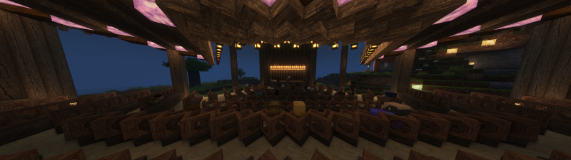
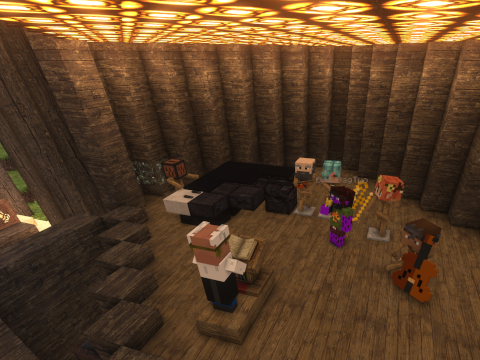

# Fox Nap 🦊


[](https://github.com/OpenBagTwo/FoxNap/actions/workflows/lint.yml)
[](https://github.com/OpenBagTwo/FoxNap/actions/workflows/build_mod.yml)
[](https://github.com/OpenBagTwo/FoxNap/actions/workflows/build_rpg.yml)

[](https://modrinth.com/mod/foxnap)

_**A Survival-, Multiplayer- and Copyright-friendly mod for adding custom music to Minecraft**_




<!-- TOC -->

* [What is This?](#what-is-this-)
* [Setup and Customization](#setup-and-customization)
    * [Manual Pack Creation](#manual-resource--data-pack-creation)
    * [Resource Pack Generator](#resource-pack-generator)
    * [Obtaining Records _and More!_](#obtaining-records-and-more)
* [Contributing](#contributing)
* [License and Acknowledgements](#license-and-acknowledgements)

<!-- TOC -->

## What is This?

FoxNap is a simple "Vanilla Plus" mod for adding custom music discs to Minecraft.

* Unlike what you can achieve with
  [resource packs alone](https://www.planetminecraft.com/blog/how-to-add-costume-music-the-easy-way-1-12/)
  music discs added via FoxNap **do not overwrite** the vanilla music discs.
* Unlike similar mods, FoxNap allows you to:
    * add as many or as few music discs as you want
    * add _whatever_ music you want
    * use _different_ music than other players on the same server
    * obtain all music discs in survival, via a
      [new villager profession](#obtaining-records-and-more)
      ([utilities for modifying creeper / treasure chest loot tables are planned](https://github.com/OpenBagTwo/FoxNap/issues/16))

FoxNap also adds custom musical instruments that you can play like goat horns,
giving you the creative freedom to stage
["live music" performances](https://www.google.com/search?q=lip+syncing+concert).



### Motivation

I started work on this mod after being inspired to extend the
[SBM Jukebox mod](https://github.com/StrikerRockers-Mods/SBM-Jukebox-fabric), which
brings the Bedrock music disc playlist functionality to Java. <!--TODO: link to my SBM tutorial if
I ever post it--> I wanted to add an outdoor concert venue to my survival world (the name FoxNap
is an homage to the [Wolf Trap](https://www.wolftrap.org/) center for the performing arts, which was
a huge fixture of my childhood), but what I kept getting hung up on was how I could source and
provide the music without violating copyright--forget about adding my own personal music collection,
even Youtube's "Free" [audio library](https://www.youtube.com/audiolibrary) was off-limits, as the
license terms explicitly state:

> You may not make available, distribute or perform the music files from this library separately
> from videos and other content into which you have incorporated these music files
> (e.g., **standalone distribution of these files is not permitted**).

As I saw it, there were two options for getting around this limitation (besides abandoning the
project or not sharing this mod with anyone)

1. Limit the music included with the mod to permissively-licensed (public domain, attribution or
   [copyleft](https://www.gnu.org/licenses/copyleft.en.html)) audio
1. Allow users to provide their own music via a config or a resource pack

In the end, I decided, [why not both?](https://www.youtube.com/watch?v=vqgSO8_cRio&t=5s)

## Setup and Customization

This mod comes pre-bundled with seven new music discs:

1. ["Colors," by Tobu](https://www.youtube.com/watch?v=eyLml-zzXzw)
2. [Camille Saint-Saëns: "Danse Macabre," performed by Kevin MacLeod](https://freemusicarchive.org/music/Kevin_MacLeod/Classical_Sampler)

* Four tracks performed by [PM Music](https://pmmusic.pro)
  from [Lud and Schlatts Musical Emporium](https://www.youtube.com/channel/UCFbtXFIaAJ0fOtgyeDs8Jog/)

    3. [Richard Strauss: Theme from _Also Sprach
       Zarathustra_](https://www.youtube.com/watch?v=9K3GQdD30F0)
    4. [Peter Ilyich Tchaikovsky: Love Theme from _Romeo &
       Juliet_](https://www.youtube.com/watch?v=unvW5g_YWEk)
    5. [Antonio Vivaldi: "Winter" from _The Four
       Seasons_](https://www.youtube.com/watch?v=VBSP75pr2bg)
    6. [Richard Wagner: Flight of the Valkyries](https://www.youtube.com/watch?v=uNkRW_9pHRQ)

7. [Nikokai Rimsky-Korsakov: "Flight of the Bumblebee" from _Tsar
   Saltan_, performed by The US Army Band](https://commons.wikimedia.org/wiki/File:Rimsky-Korsakov_-_flight_of_the_bumblebee.oga)

all of which are permissively licensed under the terms specified
[here](src/main/resources/assets/foxnap/sounds/records/LICENSES.md)
(I am redistributing them via this repo and mod under the compatible
[Creative Commons Attribution-ShareAlike 4.0 License](https://creativecommons.org/licenses/by-sa/4.0/)).

If this built-in playlist sounds like your jam, and you have no desire to add anything else, then
congrats! This is easy! This is a Fabric mod with builds for 1.19+ and depends only on
the [Fabric API](https://modrinth.com/mod/fabric-api), so just download
the appropriate build to your instance's mods folder, start the game, and
[go find a village](#obtaining-records-and-more).

But if you're interested in some customization, read on:

### Manual Resource / Data Pack Creation

FoxNap's item and sound registration structure was designed to make it as easy as possible for you
to replace or add to the mod's built-in tracks via a resource pack similar to what
[you'd make if you were replacing one of the vanilla discs](https://www.planetminecraft.com/blog/how-to-add-costume-music-the-easy-way-1-12/),
with the advantage that the number of discs provided by the mod is _completely dynamic_ and can be
set or changed simply by going into your instance's mod `config` folder, opening `foxnap.yaml` in
any plaintext editor and changing the value of `n_discs`.

From there, if you're used to vanilla disc replacement resource packs, the differences will be:

- instead of `assets/minecraft`, all your files should be in `assets/foxnap`
- the ids of the sound files you'll be replacing (in `assets/foxnap/sounds.json`) will be
  `foxnap:track_1`, `foxnap:track_2`, etc. all the way up to the number `n_discs`
  you set in the `foxnap.yaml` config file stored in your instance's mod `config` folder.
- to set or replace the record textures, you'll need to create files named `track_1.json`,
  `track_2.json`, etc. within `assets/foxnap/models/item`
- when changing the names of the tracks to display, you'll need to edit
  `assets/foxnap/lang/en_us.json` and refer to the language entries as `item.foxnap.track_1` /
  `item.foxnap.track_1.desc`, `item.foxnap.track_2` / `item.foxnap.track_2.desc`, etc.

### Resource Pack Generator

If manually converting mp3s and hand-editing JSON isn't your idea of a fun time, **this project
provides an alternative** in the form of a stand-alone and portable (read: no installation or
setup required) resource pack generator.

#### Installation

1. Download the executable from [the release page](../../releases) that
   matches your operating system and your version of the mod.
1. Depending on your operating system and security settings, you may need
   to explicitly make the resource pack generator executable (on \*nix systems.
   You can do this from a terminal by running `chmod u+x /path/to/FoxNapRPG` or by
   going into Properties in most file managers.

You can also [build the generator from source](#building-the-resource-pack-generator-from-source).

#### Generating Resource Packs

Place the generator executable in an empty folder, then move any music you
want to turn into records into that folder. **There is no limit** to the
number of tracks you can include, and they **do not** need to be pre-converted
to [Ogg](https://en.wikipedia.org/wiki/Ogg). The only requirement is that
the files have to be
[decodable by `ffmpeg`](https://www.ffmpeg.org/general.html#Supported-File-Formats_002c-Codecs-or-Features).

_**Pro Tip:** if your music files include [metadata](https://en.wikipedia.org/wiki/ID3), the title
and artist
name will get automatically extracted, and any album art will be used to help generate the music
disc texture._

When you're ready, simply double-click the `FoxNapRPG` executable. A terminal window may pop
up showing progress of the resource pack creation, and before you know it you should have some
new files in your current directory:

- `FoxNapRP.zip` is the resource pack containing all your converted songs and music disc textures,
  and you can throw that into your Minecraft `resourcepacks` folder
- `FoxNapDP.zip` is the datapack that defines all the properties of the tracks themselves. You'll
  need to put this pack into the `datapacks` folder of any world where you want to use your music
  (see note below about multiplayer).
- `foxnap.yaml` needs to go into your Minecraft `config` folder. This tells the game how many
  music discs to enable for you.

#### What About Multiplayer?

When playing on a server, it's the ***server's*** datapacks and config file that will dictate:

- how long each song will play
- the redstone signal strength coming out of jukeboxes playing each disc
- the number of tracks available from the Maestro

but it's ***each player's*** resource pack and config file that will control:

- the songs that each disc will play
- the appearance (and description) of each disc
- which discs show up as "placeholder" records

Explicitly:

- if the server has a greater number of discs specified than both what you've specified in your
  config, some discs will show up for you with placeholder
  textures and sound files
- if you have more discs in your resource pack than are set on the server, then not all tracks will
  be available in your shared game
- some music discs may continue silently after a song ends, and some might cut off

Beyond the number of discs, though, there's no reason why every player can't come online with
a completely custom playlist of songs with similar lengths!

#### Advanced Options: Command-Line Options

You can also run the generator from the command-line, which will give you access to a bunch of
additional customization options, such as setting the directories to search for music or the
locations the generated resource pack and mod config should be saved.

For further details, run:

```bash
$ ./FoxNapRPG --help
```

from the folder where you saved the generator executable.

#### Advanced Options: Spec File

The Resource Pack Generator also allows you to finely tune the resource pack generation
behavior via a configuration file. The pack generator currently supports the following formats:

- INI (.ini, .cfg, .config, .conf, .txt)
- JSON (.json)
- CSV (.csv, .tsv)
  where each entry specifies a single track via either its full path or its file name.

For each track, you can specify:

- `num`: a track number (to override the tracks bundled with the mod or just to make sure the tracks
  are ordered consistently)
- `description`: the name to give to the track (if you don't want this read from the ID3 tag)
- `hue`: the color to give to the vinyl part of the record template
- `use_album_art`: whether the album art (embedded in the track tag data) for the inlay

To use a spec configuration file when running the resource pack generator, use the `-s` command-line
flag, _e.g._

```bash
$ ./FoxNapRPG -i /path/to/my/music -s track_specs.conf
```

### Obtaining Records _and More!_

So now that you've registered these custom records to the game, how do you actually get them?
Outside of commands (_e.g._ `/give @s foxnap:track_1`) and Creative Mode, the sole way to obtain
FoxNap records is by trading with _The Maestro_, a new villager who has a Jukebox as a job site
(note
that [The Maestro does not currently spawn naturally, but this feature is planned](https://github.com/OpenBagTwo/FoxNap/issues/13)).


The Maestro will pay top dollar for [tonewood](https://en.wikipedia.org/wiki/Tonewood)--stripped
blocks of rare wood types--goat horns and non-FoxNap records and sells, alongside your custom
music discs, a wide variety of playable musical instruments (with textures adopted from the classic
[mxTune mod](https://github.com/AeronicaMC/mxTune)).

#### Disabling The Maestro

If you'd prefer _not_ to add The Maestro to your game (and would like to obtain your music discs
in some other way, such as a datapack), you can disable this part of the mod by editing your
[`foxnap.yaml` config file](#generating-resource-packs) and adding the following line:

```yaml
enable_maestro: false
```

## Contributing

Find a bug? Have a suggestion or a question? Want to contribute a new feature or enhancement?
[Open an issue](https://github.com/OpenBagTwo/FoxNap/issues/new)!

### Building the Mod from Source

1. Clone this repo
1. Download and install a Java 21 OpenJDK such as [Temurin](https://adoptium.net/temurin/releases/)
1. From the root of this repo, run `./gradlew build` or load this project into your favorite Java
   IDE and run the "build" gradle task

The compiled jar will be found under `build/libs`.

### Building the Resource Pack Generator from Source

You can also build the generator from source.

1. Clone this repo
1. [Download](https://ffmpeg.org/download.html) or install a version of `ffmpeg` that can decode
   files from your music library and that has support for encoding using `libvorbis`. Put the
   executable (or symbolic links to the executable) in the `foxnap_rpg/bin` folder.
1. Create and activate a virtual environment using python 3.10 or above
    1. If you have a [`conda`-based](https://docs.conda.io/en/latest/) environment and package
       manager installed on your
       system, such as [mambaforge](https://github.com/conda-forge/miniforge#mambaforge), you can
       use the project's
       dedicated dev/build environment, creatable from the repo root via
       `mamba env create -f environment.yml` (substitute `conda` for `mamba` as needed)
1. From the repo's root, with your virtual environment activated, run `python -m pip install .`
1. At this point, you have two options:
    1. Use FoxNap as a python package, with `$ FoxNapRPG` available from the command line
    1. Create a stand-alone executable using [`pyinstaller`](https://pyinstaller.org/en/stable/) (
       included in the `conda`
       environment). The scripts `./rpg-build.sh` for \*nix or `.\rpg-build.bat` for Windows are
       available for reference.

## License and Acknowledgements

All code in this repository is licensed under
[GPLv3](https://www.gnu.org/licenses/gpl-3.0.en.html).

Builds of the FoxNap Resource Pack Generator (`FoxNapRPG`) include binaries of
[ffmpeg](https://wwww.ffmpeg.org) which is licensed under
[the GNU Lesser General Public License (LGPL) version 2.1](https://www.gnu.org/licenses/old-licenses/lgpl-2.1.html)
or later and incorporates components licensed under
[the GNU General Public License (GPL) version 2](http://www.gnu.org/licenses/old-licenses/gpl-2.0.html)
or later.

All assets in this repository are distributed under the
[Creative Commons Attribution-ShareAlike 4.0 License](https://creativecommons.org/licenses/by-sa/4.0/)
unless
otherwise stated.

Instrument icons are taken from the mod [mxTune](https://github.com/AeronicaMC/mxTune)
by [@AeronicaMC](https://github.com/AeronicaMC).

Instrument sounds are courtesy of [Philharmonia](https://philharmonia.co.uk)'s
[sound sample library](https://philharmonia.co.uk/resources/sound-samples/).

Many thanks to [@FoundationGames](https://github.com/FoundationGames) for making the code of
his awesome [Sandwichable](https://github.com/FoundationGames/Sandwichable) mod so easy to
understand and learn from, and similarly to
[Modding by Kaupenjoe](https://www.youtube.com/c/TKaupenjoe) for his awesome and detailed
tutorials on Minecraft modding, in this case
[his tutorial for adding a custom villager profession](https://gist.github.com/Kaupenjoe/237846a971fdd254c7da9639c85e65c1).

Also shouting out [@Siphalor](https://github.com/Siphalor) and Reddit's
[jSdCool](https://www.reddit.com/user/jSdCool/) for
[this conversation](https://www.reddit.com/r/fabricmc/comments/mkumx8/comment/gticqn2/) on adding
non-mod external libraries to a Fabric mod. It should not have been this hard to add the SnakeYAML
library to a mod.
