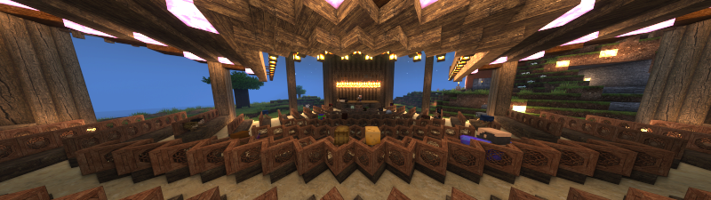
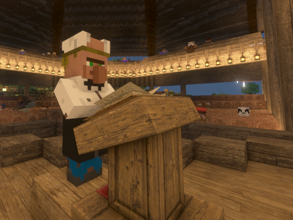

# Fox Nap 🦊


[](https://github.com/OpenBagTwo/FoxNap/actions/workflows/lint.yml)
[](https://github.com/OpenBagTwo/FoxNap/actions/workflows/build_mod.yml)
[](https://github.com/OpenBagTwo/FoxNap/actions/workflows/build_rpg.yml)

[](https://modrinth.com/mod/foxnap)

_**A Survival-, Multiplayer- and Copyright-friendly mod for adding custom music to Minecraft**_




<!-- TOC start (generated with https://github.com/derlin/bitdowntoc) -->

* [What is This?](#what-is-this)
* [Setup and Customization](#setup-and-customization)
* [Resource Pack Generator](#resource-pack-generator)
* [What About Multiplayer?](#what-about-multiplayer)
* [Obtaining Records _and More!_](#obtaining-records-and-more)
* [Fox Nap Vanilla](#fox-nap-vanilla)
* [Contributing](#contributing)
* [License and Acknowledgements](#license-and-acknowledgements)

<!-- TOC end -->

## What is This?

FoxNap is a simple "Vanilla Plus" mod for adding custom music discs to Minecraft.

* Unlike what you can achieve with
  [resource packs alone](https://www.planetminecraft.com/blog/how-to-add-costume-music-the-easy-way-1-12/)
  music discs added via FoxNap **do not overwrite** the vanilla music discs.
* Unlike similar mods, FoxNap allows you to:
    * add as many or as few music discs as you want
    * add _whatever_ music you want
    * use _different_ music than other players on the same server
    * obtain all music discs in survival, via a
      [new villager profession](#obtaining-records-and-more)
      ([utilities for modifying creeper / treasure chest loot tables are planned](https://github.com/OpenBagTwo/FoxNap/issues/16))

FoxNap also adds custom musical instruments that you can play like goat horns,
giving you the creative freedom to stage
["live music" performances](https://www.google.com/search?q=lip+syncing+concert).


## Setup and Customization

This mod comes pre-bundled with seven new music discs:

1. ["Colors," by Tobu](https://www.youtube.com/watch?v=eyLml-zzXzw)
2. [Camille Saint-Saëns: "Danse Macabre," performed by Kevin MacLeod](https://freemusicarchive.org/music/Kevin_MacLeod/Classical_Sampler)

* Four tracks performed by [PM Music](https://pmmusic.pro)
  from [Lud and Schlatts Musical Emporium](https://www.youtube.com/channel/UCFbtXFIaAJ0fOtgyeDs8Jog/)

    3. [Richard Strauss: Theme from _Also Sprach
       Zarathustra_](https://www.youtube.com/watch?v=9K3GQdD30F0)
    4. [Peter Ilyich Tchaikovsky: Love Theme from _Romeo &
       Juliet_](https://www.youtube.com/watch?v=unvW5g_YWEk)
    5. [Antonio Vivaldi: "Winter" from _The Four
       Seasons_](https://www.youtube.com/watch?v=VBSP75pr2bg)
    6. [Richard Wagner: Flight of the Valkyries](https://www.youtube.com/watch?v=uNkRW_9pHRQ)

7. [Nikokai Rimsky-Korsakov: "Flight of the Bumblebee" from _Tsar
   Saltan_, performed by The US Army Band](https://commons.wikimedia.org/wiki/File:Rimsky-Korsakov_-_flight_of_the_bumblebee.oga)

all of which are permissively licensed under the terms specified
[here](src/main/resources/assets/foxnap/sounds/records/LICENSES.md)
(I am redistributing them via this repo and mod under the compatible
[Creative Commons Attribution-ShareAlike 4.0 License](https://creativecommons.org/licenses/by-sa/4.0/)).

If this built-in playlist sounds like your jam, and you have no desire to add anything else, then
congrats! This is easy! This is a Fabric mod with builds for 1.19+ and depends only on
the [Fabric API](https://modrinth.com/mod/fabric-api), so just download
the appropriate build to your instance's mods folder, start the game, and
[go find a village](#obtaining-records-and-more).

But if you're interested in some customization, read on:

## Resource Pack Generator

While you can always [manually](../../wiki/Manual-Resource---Data-Pack-Creation)
convert mp3s and hand-edit JSON files to create a set of Fox Nap
packs, **this project
provides an alternative** in the form of a stand-alone and portable (read: no installation or
setup required) resource pack generator.

You can read more about that [here](../../wiki/Resource-Pack-Generator).

## What About Multiplayer?

When playing on a server, it's the ***server's*** datapacks and config file that will dictate:

- how long each song will play
- the redstone signal strength coming out of jukeboxes playing each disc
- the number of tracks available from the Maestro

but it's ***each player's*** resource pack and config file that will control:

- the songs that each disc will play
- the appearance (and description) of each disc
- which discs show up as "placeholder" records

Explicitly:

- if the server has a greater number of discs specified than both what you've specified in your
  config, some discs will show up for you with placeholder
  textures and sound files
- if you have more discs in your resource pack than are set on the server, then not all tracks will
  be available in your shared game
- some music discs may continue silently after a song ends, and some might cut off

Beyond the number of discs, though, there's no reason why every player can't come online with
a completely custom playlist of songs with similar lengths!

## Obtaining Records _and More!_

So now that you've registered these custom records to the game, how do you actually get them?
Outside of commands (_e.g._ `/give @s foxnap:track_1`) and Creative Mode, the sole way to obtain
FoxNap records is by trading with _The Maestro_, a new villager who has a Jukebox as a job site
(note
that [The Maestro does not currently spawn naturally, but this feature is planned](https://github.com/OpenBagTwo/FoxNap/issues/13)).



The Maestro will pay top dollar for [tonewood](https://en.wikipedia.org/wiki/Tonewood)--stripped
blocks of rare wood types--goat horns and non-FoxNap records and sells, alongside your custom
music discs, a wide variety of playable musical instruments (with textures adopted from the classic
[mxTune mod](https://github.com/AeronicaMC/mxTune)).

### Disabling The Maestro

If you'd prefer _not_ to add The Maestro to your game (and would like to obtain your music discs
in some other way, such as a datapack), you can disable this part of the mod by editing your
[`foxnap.yaml` config file](#manual-resource--data-pack-creation) and adding the following line:

```yaml
enable_maestro: false
```

## Fox Nap Vanilla

With the release of Minecraft 1.21, music discs are now entirely data-driven! As such, the
resource and datapacks generated by the Fox Nap Resource Pack Generator are entirely compatible
with the vanilla game. Details can be found on
[the wiki](../../wiki/Using-the-Resource-Pack-Generator-in-Vanilla).

## Contributing

Find a bug? Have a suggestion or a question? Want to contribute a new feature or enhancement?
[Open an issue](https://github.com/OpenBagTwo/FoxNap/issues/new)!

### Building the Mod from Source

1. Clone this repo
1. Download and install a Java 21 OpenJDK such as [Temurin](https://adoptium.net/temurin/releases/)
1. From the root of this repo, run `./gradlew build` or load this project into your favorite Java
   IDE and run the "build" gradle task

The compiled jar will be found under `build/libs`.

### Building the Resource Pack Generator from Source

Instructions for building the resource pack generator can be found
[on the wiki](../../wiki/Resource-Pack-Generator#building-the-resource-pack-generator-from-source)

## License and Acknowledgements

All code in this repository is licensed under
[GPLv3](https://www.gnu.org/licenses/gpl-3.0.en.html).

Builds of the FoxNap Resource Pack Generator (`FoxNapRPG`) include binaries of
[ffmpeg](https://wwww.ffmpeg.org) which is licensed under
[the GNU Lesser General Public License (LGPL) version 2.1](https://www.gnu.org/licenses/old-licenses/lgpl-2.1.html)
or later and incorporates components licensed under
[the GNU General Public License (GPL) version 2](http://www.gnu.org/licenses/old-licenses/gpl-2.0.html)
or later.

All assets in this repository are distributed under the
[Creative Commons Attribution-ShareAlike 4.0 License](https://creativecommons.org/licenses/by-sa/4.0/)
unless
otherwise stated.

Instrument icons are taken from the mod [mxTune](https://github.com/AeronicaMC/mxTune)
by [@AeronicaMC](https://github.com/AeronicaMC).

Instrument sounds are courtesy of [Philharmonia](https://philharmonia.co.uk)'s
[sound sample library](https://philharmonia.co.uk/resources/sound-samples/).

Many thanks to [@FoundationGames](https://github.com/FoundationGames) for making the code of
his awesome [Sandwichable](https://github.com/FoundationGames/Sandwichable) mod so easy to
understand and learn from, and similarly to
[Modding by Kaupenjoe](https://www.youtube.com/c/TKaupenjoe) for his awesome and detailed
tutorials on Minecraft modding, in this case
[his tutorial for adding a custom villager profession](https://gist.github.com/Kaupenjoe/237846a971fdd254c7da9639c85e65c1).

Also shouting out [@Siphalor](https://github.com/Siphalor) and Reddit's
[jSdCool](https://www.reddit.com/user/jSdCool/) for
[this conversation](https://www.reddit.com/r/fabricmc/comments/mkumx8/comment/gticqn2/) on adding
non-mod external libraries to a Fabric mod. It should not have been this hard to add the SnakeYAML
library to a mod.
